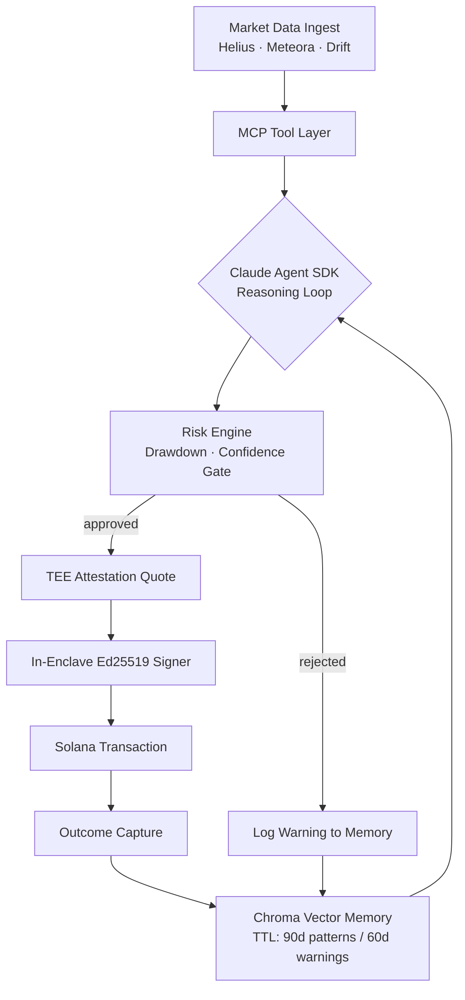

<div align="center">

# enclave-trade

**Autonomous Solana trading agent with in-enclave key custody and attested execution.**
Private keys are generated inside a TEE. They never leave. Every trade is provably honest.

[](https://github.com/YOUR_ORG/enclave-trade/actions)
[](LICENSE)
[](https://docs.anthropic.com/en/docs/agents-and-tools/claude-agent-sdk)
[](https://www.typescriptlang.org/)

</div>

---

Most agents store private keys in `.env` files. One leak and everything is gone.

`enclave-trade` runs its entire decision loop inside a **Trusted Execution Environment**.
The Ed25519 signing key is generated inside the enclave and sealed there permanently.
The host machine, the cloud provider, and the operator cannot read it.

```
OBSERVE → REASON → ATTEST → SIGN → EXECUTE → LEARN
```

Every trade emits a remote attestation quote. Every decision is logged to an immutable JSONL audit trail.
The agent that runs tomorrow is smarter than the one today. The key has never been seen by anyone.

---

## System Architecture

```
┌──────────────────────────────────────────────────────────────┐
│                    TEE Boundary (TDX / SEV-SNP)              │
│                                                              │
│  ┌─────────────┐    ┌──────────────────┐    ┌────────────┐  │
│  │  MCP Server │───▶│  Claude Agent    │───▶│  Ed25519   │  │
│  │  (data in)  │    │  SDK Loop        │    │  Signer    │  │
│  └─────────────┘    └────────┬─────────┘    └─────┬──────┘  │
│                              │                    │         │
│                    ┌─────────▼─────────┐          │         │
│                    │   Risk Engine     │          │         │
│                    │   Memory (Chroma) │          │         │
│                    └─────────┬─────────┘          │         │
│                              │ Remote Quote        │         │
└──────────────────────────────┼────────────────────┼─────────┘
                               ▼                    ▼
                    ┌─────────────────┐   ┌──────────────────┐
                    │  Attestation    │   │   Solana RPC     │
                    │  Verifier       │   │   (tx submit)    │
                    └─────────────────┘   └──────────────────┘
```

---

## Core Engine — TEE + MCP

### Trusted Execution Environment

| Layer | Component | Function |
|-------|-----------|----------|
| **Key Custody** | `src/enclave/signer.ts` | Ed25519 key gen inside TEE, sealed with AES-256-GCM |
| **Attestation** | `src/enclave/attestation.ts` | Remote quote per trade, verifiable externally |
| **TEE Runtime** | `src/enclave/tee.ts` | Intel TDX / AMD SEV-SNP / software mode |

### MCP Tool Surface

| Tool | Source | Purpose |
|------|--------|---------|
| `solana_get_price` | Helius + Birdeye | Real-time token price, OHLCV |
| `solana_get_pool_state` | Meteora DLMM | Bin range, TVL, fee rate |
| `solana_get_funding_rate` | Drift Protocol | Perp funding rate, OI |
| `jupiter_get_quote` | Jupiter v6 | Best swap route, price impact |
| `solana_get_wallet_positions` | Helius | Current positions, P&L |
| `enclave_execute_trade` | Internal | Final execution intent |

---

## Agent Decision Loop



---

## Performance Metrics

| Metric | Target |
|--------|--------|
| Decision latency | < 3.5s |
| Attestation overhead | < 120ms |
| Tx confirmation | < 1.2s |
| Memory retrieval | < 80ms |
| Cycle interval | 15 min (default) |

---

## Quick Start

```bash
git clone https://github.com/YOUR_ORG/enclave-trade
cd enclave-trade && bun install
bun run setup         # interactive wizard
docker-compose up chroma -d
bun run dev
```

Paper trading is on by default.

---

## Configuration

```bash
ANTHROPIC_API_KEY=sk-ant-...
HELIUS_API_KEY=...
SOLANA_RPC_URL=https://mainnet.helius-rpc.com/?api-key=...
TEE_MODE=software        # software | tdx | sev
PAPER_TRADING=true
CONFIDENCE_THRESHOLD=0.65
MAX_POSITION_SIZE_USD=500
GLOBAL_DRAWDOWN_LIMIT=0.15
```

See [.env.example](.env.example) for all options.

---

## Risk Infrastructure

- Global drawdown `-15%` halts all new positions
- Per-strategy drawdown `-20%` halts strategy
- Confidence gate: minimum `0.65` to execute
- Human approval required for trades > `$500`
- Circuit breaker: 3 losses in 1h → 4h cooldown
- Trade idempotency prevents duplicate execution

---

## Roadmap

| Phase | Status | Scope |
|-------|--------|-------|
| **Phase 1** | ✅ | Agent loop, MCP server, memory, paper trading |
| **Phase 2** | 🔄 | Intel TDX production support, AMD SEV-SNP |
| **Phase 3** | 🗓 Q3 2026 | Live execution: Meteora DLMM, Drift perps, Jupiter spot |
| **Phase 4** | 🗓 Q4 2026 | On-chain vault (Anchor), multi-TEE threshold signing |

---

## License

AGPL-3.0

---

*built for the trenches. keys stay in the box.*
